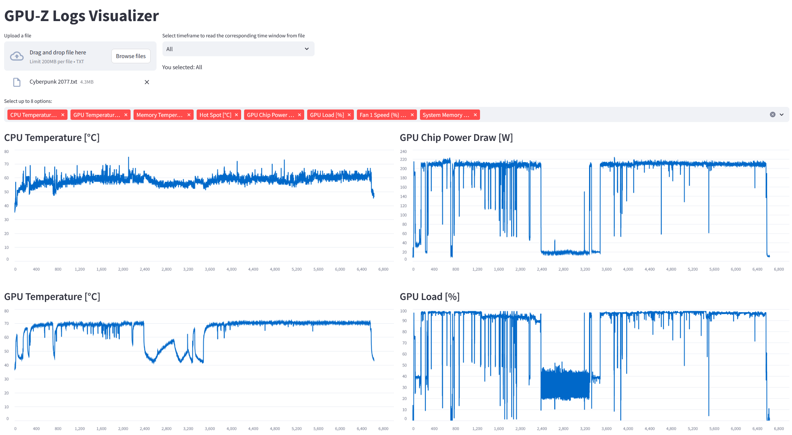
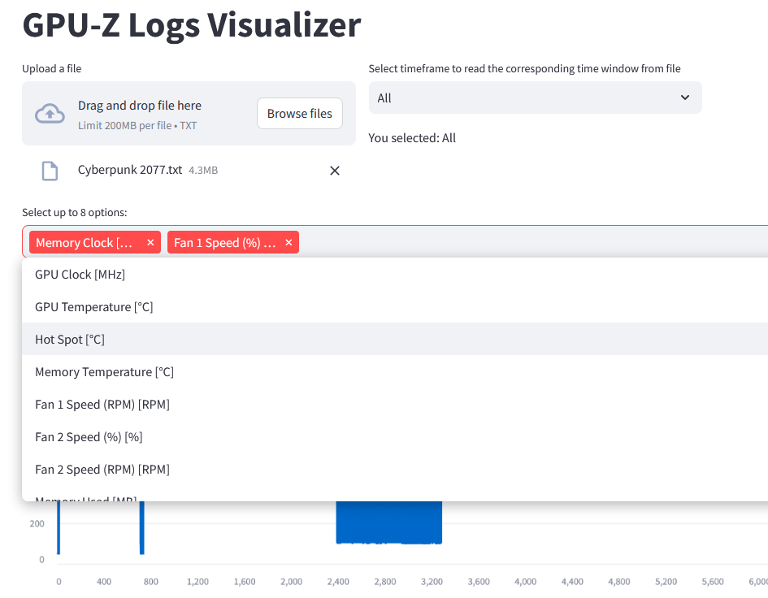
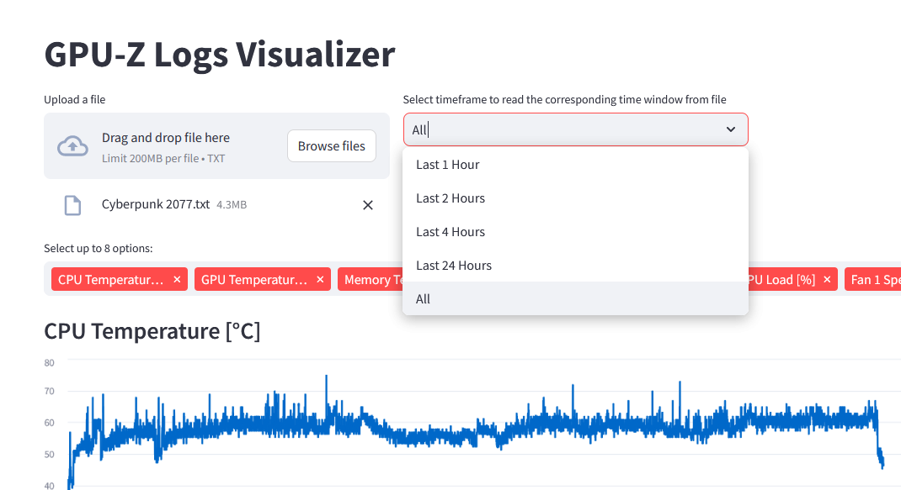
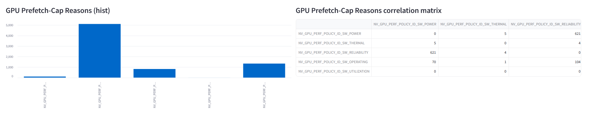

# Sensors Active Monitoring v1.0
Sensor Active Monitoring (SAM) is designed to visualize and analyze the sensors logs from GPU-Z, and alert over potential issues before damage occurs.
This can be abnormally high temperature (GPU, CPU, RAM, etc.) and any other sensor.<br>
SAM is using Streamlit to provide a simple interactive Web-GUI, and allows for dynamic sensors' selection. <br> 
The data can be filtered by time, and using Streamlit's graphs it enables hover and zoom. 

# Screenshots

## The Main Page

<br><br>
## Selecting Sensors

<br><br>
## Selecting by Hours

<br><br>
## GPU Prefetch Cap Reason


## Installation
* Clone the repo
* Create a conda environment using the requirements.txt file. Tested with Python >= 3.10.
``` 
pip install -r requirements.txt
```
* The main file is sensors_active_monitoring\src\webapp\app.py you may run it using commandline:

``` 
cd c:\myprojects\sensors_active_monitoring\src
c:\myprojects\my_conda_envs\sensor_active_monitoring_env\python.exe run.py
``` 
* This will open your browser with the main screen.
* Select a GPU-Z Log file and load it into Sensor Active Monitoring


## Future Release Plans
* Add a better time filtering, perhaps with range
* Add dates range above the charts (since Streamlit plots have difficulty with dates)
* Add more analytics

## Project
This project is developed and maintained by [Shay Amram](https://www.linkedin.com/in/shay-amram-69924051/)
